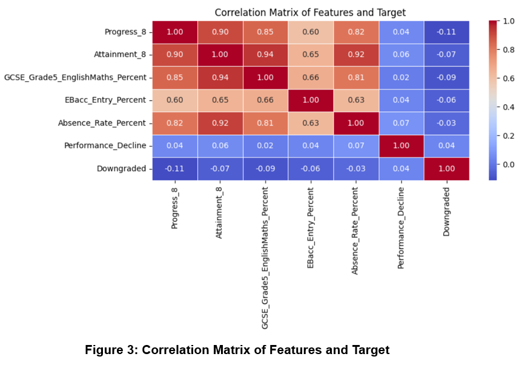

# 📉 Predicting Ofsted Downgrades in UK Secondary Schools

## 1. 📘 Business Problem & Data Sources

### Problem Statement
In the majority of cases, schools do not experience an abrupt decline in quality. Rather, before an Ofsted inspection results in a downgraded rating (e.g., "Good" → "Requires Improvement"), there are typically **early warning signs** such as:

- Declining Progress 8 scores
- Rising absence rates
- Falling GCSE attainment (Grade 5+ in English and Maths)

These signals are often **overlooked until it’s too late** for effective intervention.

This project proposes a **data-driven early warning system** that uses publicly available datasets to **identify “Good”-rated schools showing early signs of decline**. This system will support:

-  Early identification of at-risk schools
-  Targeted interventions
-  Improved outcomes and reduced cost of recovery

---

## 2. 📂 Data Sources & Technical Setup

###  Datasets Used

We use two main open datasets:

- **Key Stage 4 (KS4) Performance Data** – [DfE School Performance Tables](https://www.compare-school-performance.service.gov.uk/download-data)
- **Ofsted Inspection Outcomes** – [GOV.UK Ofsted Releases](https://www.gov.uk/government/collections/ofsted-inspections-statistical-releases)

### ⚙️ Technical Stack

We use Python and the following libraries:
- `pandas` for data cleaning and merging
- `numpy` for numeric processing
- `matplotlib`, `seaborn` for visualization
- `scikit-learn` for machine learning (Logistic Regression, model evaluation)

---

## 3. 🧪 Data Analysis

After cleaning and merging data from three academic years (2021–2023), we conducted exploratory data analysis:

- **Progress 8** and **Attainment 8** fluctuate over time
- Correlation matrix revealed:
  - Strong correlation between GCSE Grade 5+ and Progress 8
  - Absence Rate had a **negative correlation** with performance metrics (~−0.82)

### 📊 Correlation Matrix
  
*Correlation matrix showing strong relationships between GCSE scores, Progress 8, and Absence Rate.*

---

## 4. 🛠️ Feature Engineering

To enhance predictive power:

- Created a feature called `Performance_Decline`: flags schools with **2-year consecutive drop** in Progress 8.
- Removed 465 rows missing GCSE Grade 5+ scores.
- Encoded Ofsted downgrade as binary target.

### 📈 Performance Decline Distribution
  
*Distribution of `Performance_Decline` feature showing prevalence of consistent academic drop-offs.*

---

## 5. 🤖 Machine Learning

We trained a **Logistic Regression classifier** for binary classification:

- **Why Logistic Regression?**  
  - Interpretable coefficients  
  - Suitable for binary outcomes  
  - Handles class imbalance with `class_weight='balanced'`

- **Model Inputs:**  
  - Progress 8  
  - Attainment 8  
  - GCSE Grade 5+ %  
  - EBacc Entry %  
  - Absence Rate %  
  - Performance_Decline

---

## 6. 📈 Model Performance

| Metric                | Result   |
|-----------------------|----------|
| Accuracy              | 66%      |
| Recall (Downgrades)   | 59%      |
| Precision             | 10%      |
| True Positives (TP)   | 44       |
| True Negatives (TN)   | 768      |

### 🔍 Confusion Matrix
  
*Confusion matrix for Logistic Regression model—balanced class weights improve downgrade recall.*

### 🧮 Feature Coefficients
  
*Logistic Regression coefficients showing strongest predictors of downgrade risk.*

---

## 7. 🔮 Hypothetical Scenarios

### 📍 Scenario A: High-Risk School

| Feature                                | Value     |
|----------------------------------------|-----------|
| Progress 8                             | -0.60     |
| Attainment 8                           | 42        |
| GCSE Grade 5+ (English & Maths)        | 45%       |
| EBacc Entry %                          | 20%       |
| Absence Rate %                         | 7.0%      |
| Performance Decline (2-year drop)      | Yes (1)   |
| **Predicted Downgrade Probability**    | **96.79%** |

### 📍 Scenario B: Low-Risk School

| Feature                                | Value     |
|----------------------------------------|-----------|
| Progress 8                             | +0.50     |
| Attainment 8                           | 55        |
| GCSE Grade 5+ (English & Maths)        | 60%       |
| EBacc Entry %                          | 30%       |
| Absence Rate %                         | 4.0%      |
| Performance Decline                    | No (0)    |
| **Predicted Downgrade Probability**    | **12.48%** |

### 📊 Hypothetical Case Comparison
  
*Side-by-side comparison of features and downgrade risk probabilities.*

---

## 8. ✅ Recommendations

- Intervene early in schools with:
  - Declining Progress 8 and GCSE Grade 5+
  - High absence rates
- Prioritize funding and resources for flagged schools
- Integrate this model into dashboards for ongoing monitoring

---

## 9. 🧰 How to Run the Project

## 🔭 Future Work

- Explore additional models (Random Forest, XGBoost)
- Include demographic and regional features
- Deploy as a web dashboard (e.g., Streamlit or Flask)
- Integrate with real-time school data APIs

---

## 📚 References

- [DfE School Performance Tables](https://www.compare-school-performance.service.gov.uk/download-data)
- [Ofsted Statistical Releases](https://www.gov.uk/government/collections/ofsted-inspections-statistical-releases)
- Gelman, A., & Hill, J. (2006). *Data Analysis Using Regression and Multilevel/Hierarchical Models*
